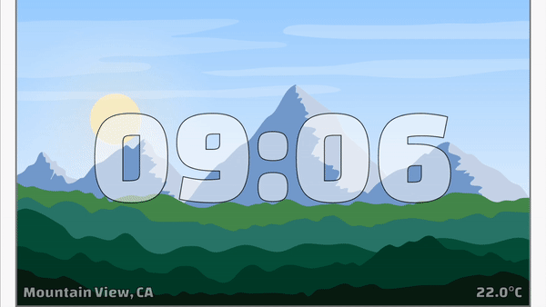
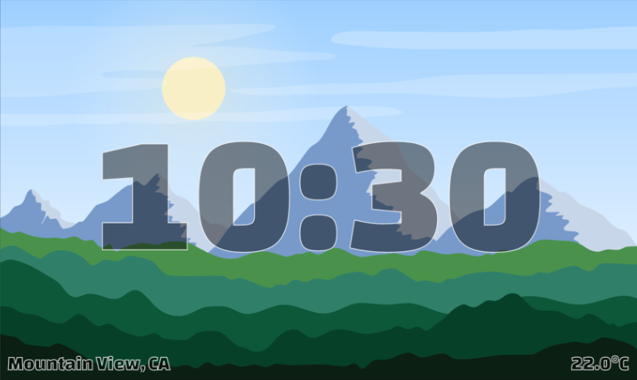

# Landscape Clock

This is a landscape clock which shows a beautiful landscape that adjusts
to the time of day and as well the weather.

<!--TODO preview images-->
<!---->

<!---->

<!---->

## Attribution
Landscape images
- landscape1: https://www.freepik.com/free-vector/desert-with-bright-sun-tall-cactuses_5323450.htm
- landscape2: https://www.freepik.com/free-vector/mountains-with-bright-sun-flying-birds_5323463.htm#page=1&query=sun&position=37

Moon
- https://www.freepik.com/free-vector/night-landscape-background-with-big-moon_1084495.htm#page=1&query=moon&position=0

Sun
- self created

## TODO

- can use location, temperature, dark/light theme, ...
  - widget.model.temperatureString

- morph time (
  - https://medium.com/flutter-community/paths-in-flutter-a-visual-guide-6c906464dcd0
  - https://pub.dev/packages/path_morph
- animate sun/moon
- background in layers, so we can switch in clouds/stars/...
- show/animate stars
- sun and moon position correctly (probably hard)
- darken/lighten background based on sun position (and moon position)
  - https://medium.com/flutterpub/blend-it-like-anything-3fe67148f3f4
- maybe even show the real weather? (will be harder)
  - just as "overlay"
  - not animated (or animation optional?)
- adjust color of time
- heaven as circular gradient?