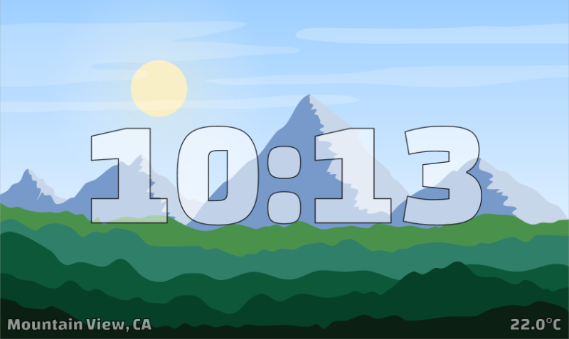

# Landscape Clock

This is a landscape clock which shows a beautiful landscape that adjusts
to the time of day and as well the weather.

<!--TODO preview images-->
<!---->

<!---->

<!---->

## Attribution
Landscape images
- landscape1: https://www.freepik.com/free-vector/desert-with-bright-sun-tall-cactuses_5323450.htm
- landscape2: https://www.freepik.com/free-vector/mountains-with-bright-sun-flying-birds_5323463.htm

Moon
- https://www.freepik.com/free-vector/night-landscape-background-with-big-moon_1084495.htm

Sun
- self created

Rain: https://www.freepik.com/free-vector/classic-monsoon-season-composition-with-realistic-design_2686584.htm
Snow: https://www.freepik.com/free-vector/winter-season-landscape-with-christmas-tree-snow-vector-background_5908693.htm

## TODO
- sun and moon position correctly (would need more clearer location details)
